# Отчёт по лабораторной работе «Администрирование облачного сервиса в Yandex Cloud с учетом гранта 4000 рублей»

## Цель работы

Освоить базовые приемы развертывания и администрирования защищенного сервиса в облачной инфраструктуре Yandex Cloud: создать виртуальную машину, настроить сетевой доступ, опубликовать веб-приложение, организовать резервное копирование и оценить затраты.

## Схема инфраструктуры
```
Интернет
    │
    ▼
Security Group
├── 80/tcp → все (nginx)
└── 22/tcp → только мой IP
    │
    ▼
ВМ
├── nginx → /var/www/html/index.html
└── cron → backup.sh → /tmp/backup_YYYYMMDD.tar.gz
    │
    ▼
Object Storage
└── backup.tar.gz
```

## Скриншоты виртуальной машины и Bucket
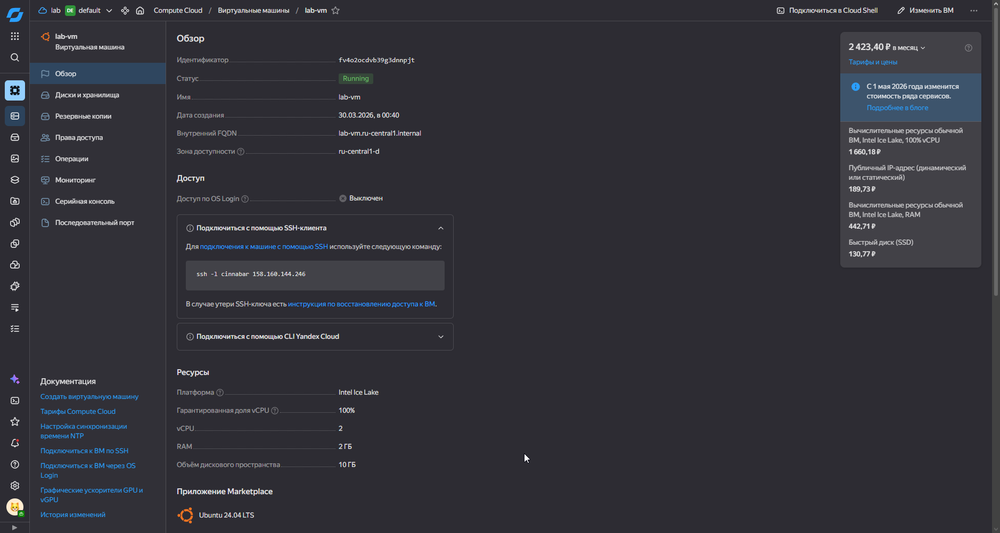
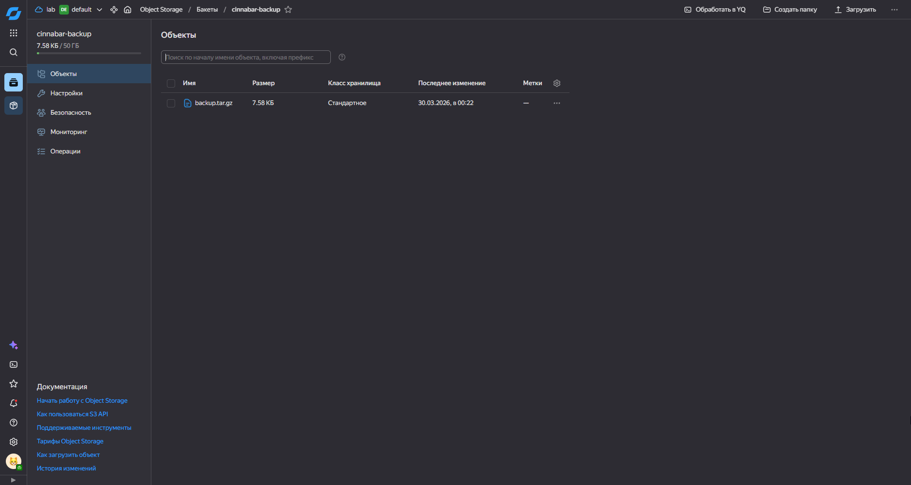

## Настройки Security Group
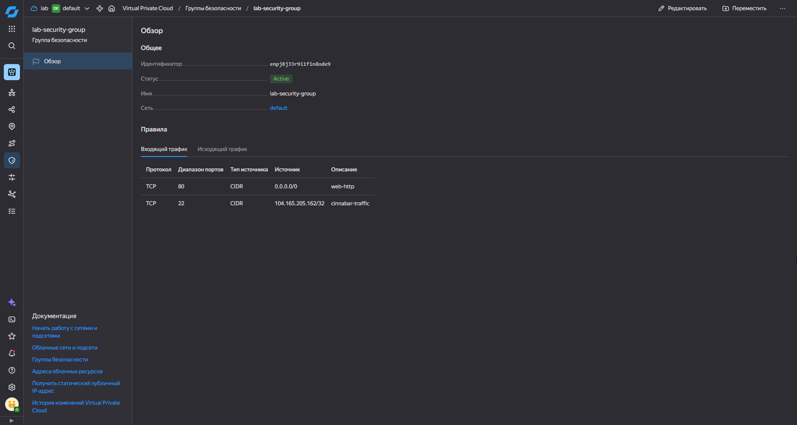
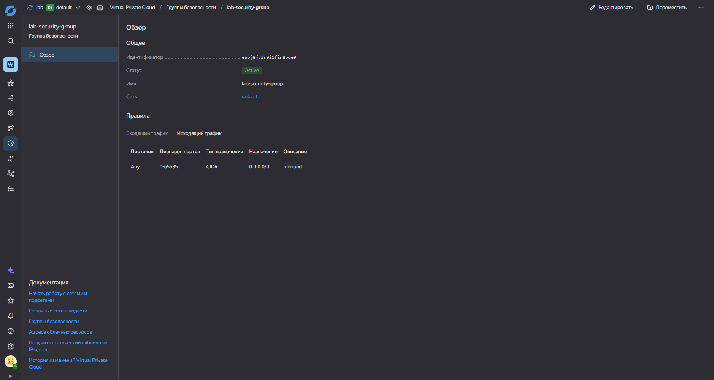

## Подтверждение работы SSH по ключу
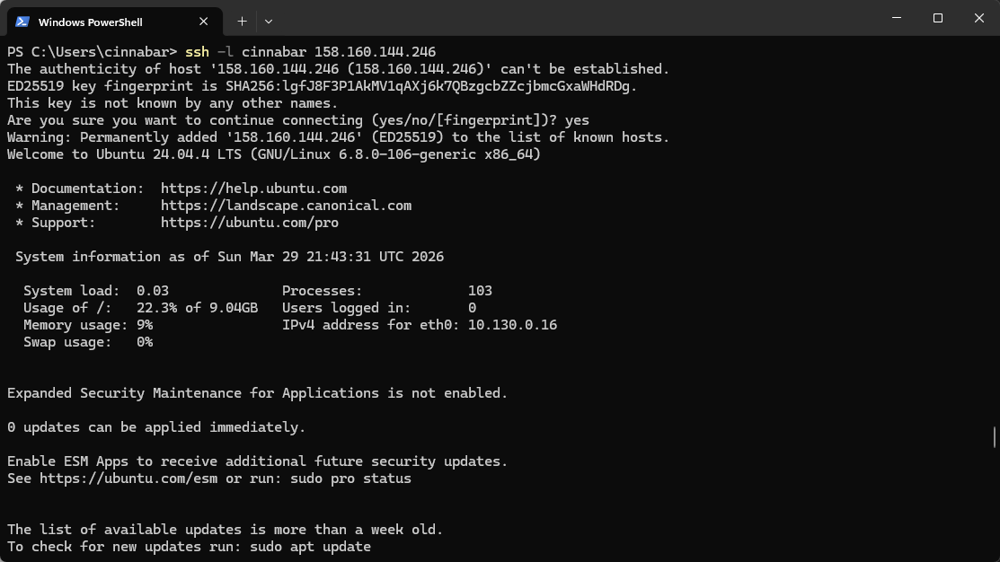

## Скриншот работающего веб-сервиса
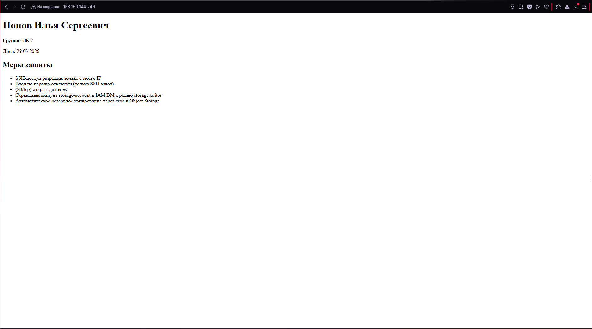

## Подтверждение наличия резервной копии и восстановление
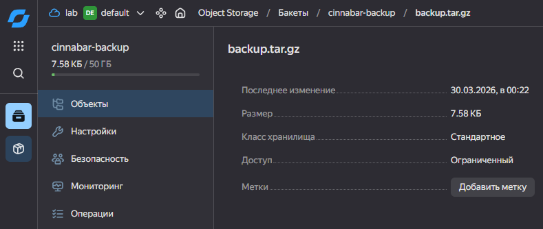
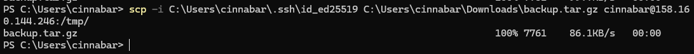
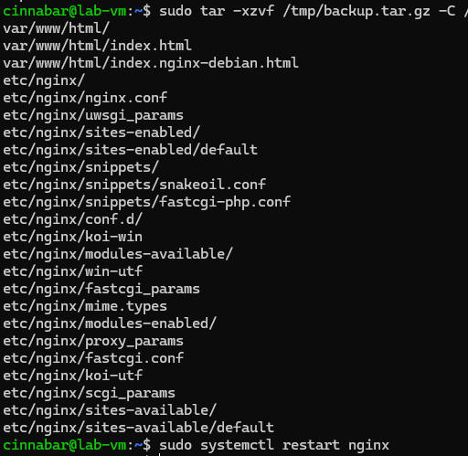

## Автоматическое создание резерной копии в Object Storage через cron
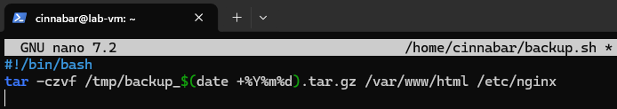
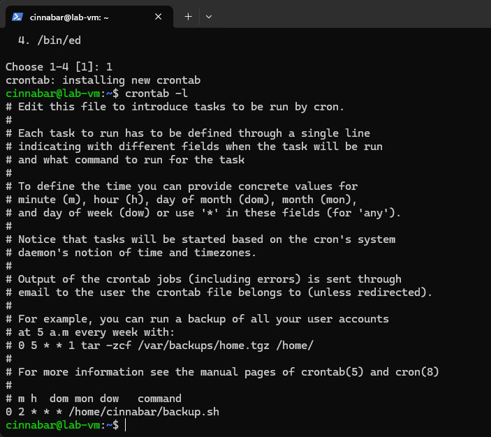


## Подтверждение отключения парольной авторизации
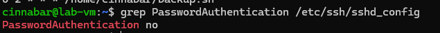

## Оценка затрат
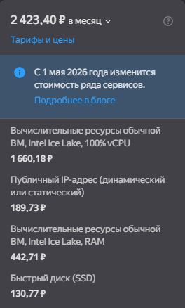

Лимит в 4000₽ соблюдается. Не используются лишние функции наподобие Cloud Backup, несущие за собой лишние расходы.

## Меры защиты
- SSH доступ только с одного IP
- Вход по паролю отключён
- Открыты только порты 22 и 80
- Сервисный аккаунт с минимальными правами
- Автоматическое резервное копирование через cron

## Контрольные вопросы

### 1. Чем IAM-роли в облаке отличаются от прав пользователя внутри Linux-сервера?
IAM-роли управляют доступом к облачным ресурсам (ВМ, бакеты, сети) на уровне Yandex Cloud. Права пользователя Linux управляют доступом к файлам и процессам внутри самой ВМ. Это два независимых уровня безопасности.

### 2. Почему вход по SSH-ключу безопаснее парольной аутентификации?
Пароль можно подобрать брутфорсом или украсть. SSH-ключ - это криптографическая пара (SHA-256, RSA, Ed25519 и другие), закрытый ключ никогда не передаётся по сети и его практически невозможно подобрать.

### 3. Для чего ограничивать SSH-доступ по IP-адресу?
Даже если ключ украден, злоумышленник с другого IP не сможет подключиться.

### 4. Почему резервная копия не должна храниться только на самой виртуальной машине?
Если ВМ сломается, удалится или будет взломана - копия тоже пропадёт. Резервная копия должна храниться отдельно, например в Object Storage.

### 5. Какие облачные ресурсы могут тарифицироваться даже после остановки ВМ?
Диск и публичный статический IP-адрес продолжают списывать деньги после остановки ВМ.

### 6. В чем состоит принцип минимальных привилегий в облачной инфраструктуре?
Каждый пользователь и сервисный аккаунт должен иметь только те права которые необходимы для его работы. Например `storage.editor` только для загрузки в бакет, а не `admin` на всё облако.